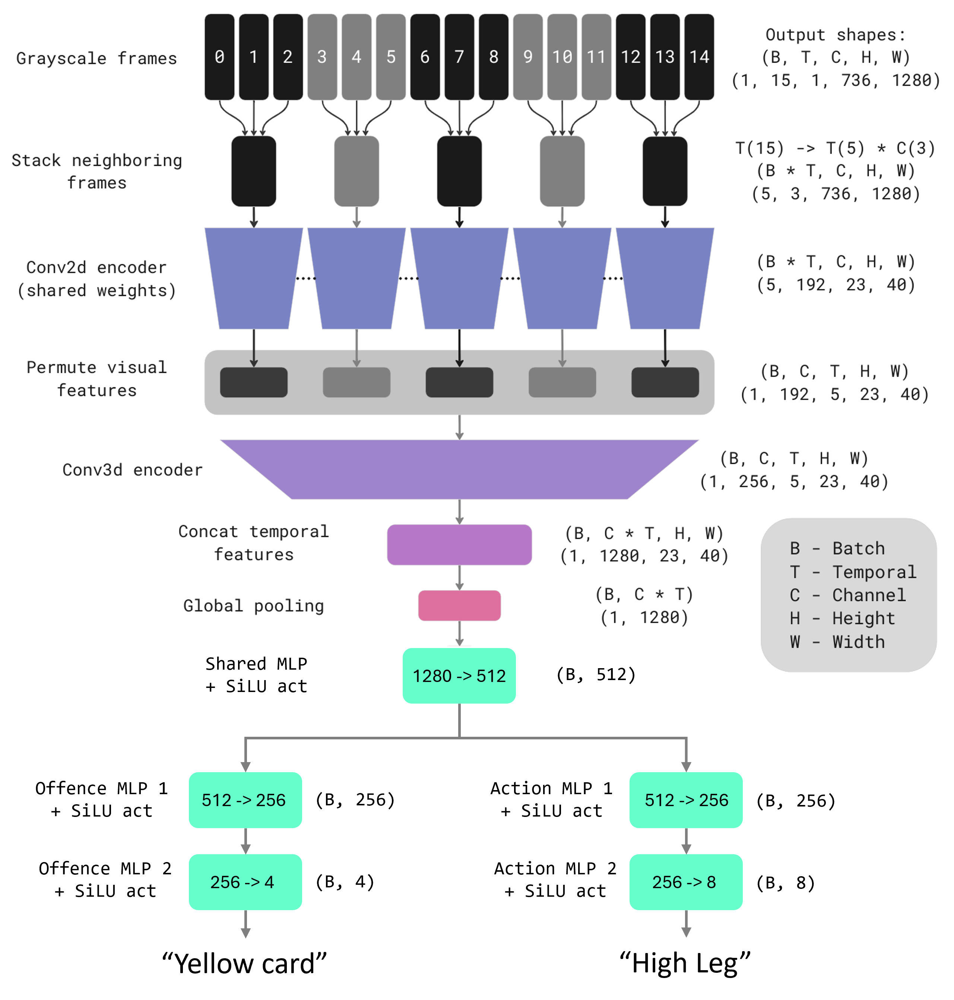

## Single-View Foul Recognition
This repo contains all the code and instructions necessary to reproduce the results of the MobiusLabs submission to the 2024 Soccernet Multi-view Foul Recognition challenge. It is a fork from the original repo [here](https://github.com/SoccerNet/sn-mvfoul).

While the challenge contains multiple views per foul, the proposed model solely relies on view 0 (i.e., the live feed of the main camera). We do this as we find some issues with the replays, as the temporal upsampling applied to match the framerate of the original video has introduced some temporal artefacts. We use the multidim stacker architecture proposed originally for ball action recognition. Due to its efficient stacking of grayscale frames, it allows to input 15 720p resolution frames, which allows us to only consider view 0 as the resolution is high enough to capture enough details around the actual foul, which only captures a fraction of the frame in view 0. 



We use the weights pretrained on the action recognition dataset, and finetune on the train/validation set for 50 epochs. Compared to the baseline, we introduce the following main changes:
* The feature extraction backbone is ConvNet based, which makes the whole model smaller and thus allows to use high-resolution input
* We only use view 0 as input and operate on 720p input
* Modified data augmentation pipeline, with slightly less aggressive parameters
* Adding non-linear activations (SiLU) and dropout regularization in between the MLP layers
* We train using float16, which allows to roughly double the batch size

## Steps to reproduce the submitted result

### Get the dataset
Follow the [link](https://pypi.org/project/SoccerNet/) to easily download the SoccerNet pip package.

If you want to download the data and annotations, you will need to fill a [NDA](https://docs.google.com/forms/d/e/1FAIpQLSfYFqjZNm4IgwGnyJXDPk2Ko_lZcbVtYX73w5lf6din5nxfmA/viewform) to get the password.

Then use the API to downlaod the data:

```
from SoccerNet.Downloader import SoccerNetDownloader as SNdl
mySNdl = SNdl(LocalDirectory="path/to/SoccerNet")
mySNdl.downloadDataTask(task="mvfouls", split=["train","valid","test","challenge"], password="enter password")
```
To obtain the data in 720p which is used in the proposed method, add version = "720p" to the input arguments. 
Unzip each folder while maintaining the naming conventions. (Train, Valid, Test, Chall).

### Install the dependencies
Run the following lines to install all the dependencies:
```
conda create -n vars python=3.9

conda activate vars

Install Pytorch with CUDA : https://pytorch.org/get-started/locally/

pip install SoccerNet

pip install -r requirements.txt

pip install pyav

```

### Get the model weights
Download the model weights from [here](https://drive.google.com/drive/folders/1Q-ycV8-C-oLKx2fGudIv3bUdbOyCz9sw?usp=drive_link), and put the `model_weights` folder into the root directory of this repo.

### Run the evaluation
Go to the root of this repo and run:

```
python main.py --path /path/to/720p/videos/ --GPU 0 --model_name MULTDIMSTACKER_VIEW0 --temp_stride 1 --pooling multidim_stacking --pre_model multidim_stacker --fp16 --decode_height 726 --N_frames 15 --only_evaluation 2 --path_to_model_weights './model_weights/10_model.pth.tar' --use_tta --view_mode only_view0
```

**Important**: The model was trained on 720 videos, so make sure you are using those as input.

The model used above should get the following result on the test set:
```
TEST
{
'accuracy_offence_severity': 32.669322709163346, 
'accuracy_action': 29.482071713147413, 
'dist_offence_gt': array([ 21., 157.,  68.,   5.]), 
'per_class_offence': array([0.47619048, 0.27388535, 0.39705882, 0.4       ]), 
'balanced_accuracy_offence_severity': 38.67836625095899, 
'dist_action_gt': array([ 43., 107.,   6.,  28.,   5.,  11.,  46.,   5.]), 
'per_class_action': array([0.62790698, 0.19626168, 0.33333333, 0.32142857, 0.6       ,    0.63636364, 0.        , 1.        ]), 
'balanced_accuracy_action': 46.44117750140897, 
'leaderboard_value': 42.55977187618398
}
```


## License
See the [License](LICENSE) file for details.


## Citation

Please cite this repo if you use this code:
```
@software{Ruefenacht_Single-View_VARS_2024,
author = {Ruefenacht, Dominic},
license = {GPL-3.0},
month = jun,
title = {{Single-View VARS}},
url = {https://github.com/druefena/MVFoul},
version = {1.0.0},
year = {2024}
}
```


and make sure to cite the original work this is based on as well.

```
@InProceedings{Held2023VARS,
    author    = {Held, Jan and Cioppa, Anthony and Giancola, Silvio and Hamdi, Abdullah and Ghanem, Bernard and Van Droogenbroeck, Marc},
    title     = {{VARS}: Video Assistant Referee System for Automated Soccer Decision Making From Multiple Views},
    booktitle = cvsports,
    month     = Jun,
    year      = {2023},
	publisher = ieee,
	address = seattle,
    pages     = {5085-5096}
}
```
